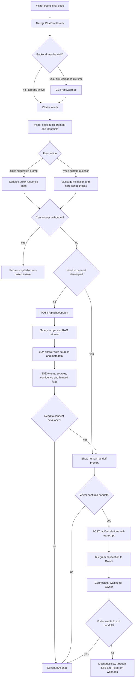
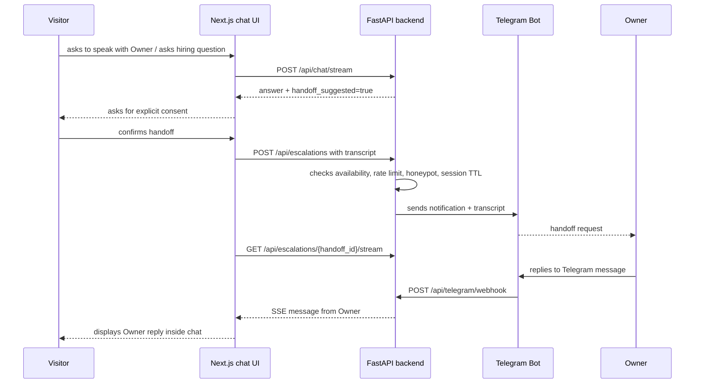
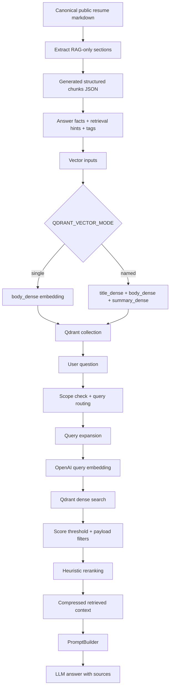
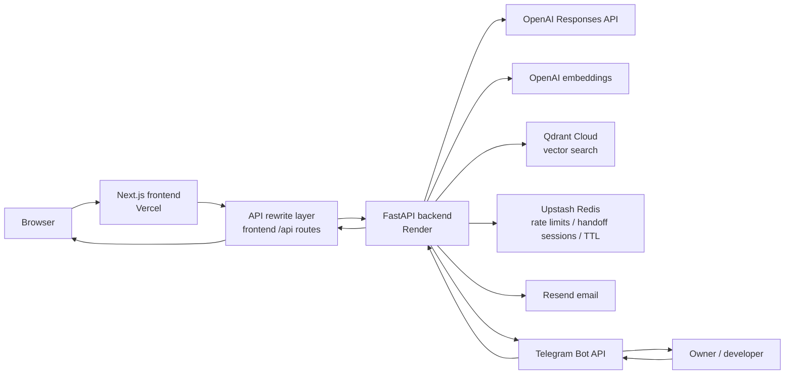

# ⚡ alextym.com — AI-powered portfolio web product with RAG Chatbot

> Documentation is available in English and Russian: [Русская версия](README.ru.md).

<p align="center">
  <em>A portfolio website built as a small AI-powered web product: interactive resume, RAG chat, SEO setup, video demo, contact flow, and human handoff via Telegram.</em>
</p>

<p align="center">
  <a href="https://github.com/AlexTymosh/alextym.com/actions/workflows/ci.yml"></a>
  <a href="https://opensource.org/license/mit/"></a>

  <a href="https://nextjs.org/"></a>
  <a href="https://react.dev/"></a>
  <a href="https://www.typescriptlang.org/"></a>
  <a href="https://tailwindcss.com/"></a>
  <a href="https://www.python.org/"></a>
  <a href="https://fastapi.tiangolo.com/"></a>
  <a href="https://openai.com/"></a>
  <a href="https://qdrant.tech/"></a>
  <a href="https://vercel.com/"></a>
  <a href="https://render.com/"></a>
  <a href="https://www.docker.com/"></a>
  <a href="https://upstash.com/">
  </a>
  <a href="https://core.telegram.org/bots/api"></a>
  
  
</p>

---

## 🌐 Live Demo

🚀 **Frontend:** [https://alextym.com](https://alextym.com)  
⚙️ **Backend health endpoint:** [https://alextym-backend.onrender.com/api/health/live](https://alextym-backend.onrender.com/api/health/live)

---

## 🖼️ Product screenshots / demos

### 1. Home page / product overview

File: `docs/assets/home-overview.png`


### 2. AI/RAG chat flow and handoff prompt

File: `docs/assets/chat-demo.gif`


### 3. Interactive resume filter

File: `docs/assets/resume-filter-demo.gif`


---

## 🧠 Overview

**alextym.com** is a portfolio website built as an **AI-powered web product**.

The website includes an AI chat, an interactive resume, a contact form, a YouTube demo, and a **human handoff** mechanism: if the AI cannot answer reliably or the visitor asks for direct contact, the chat offers to switch to the website owner. In this scenario, the Telegram webhook passes the active session with the conversation history, and the chat state switches between the AI assistant and a human.

The RAG pipeline uses Qdrant + OpenAI embeddings. To improve answer quality, the following approaches are used together:
- dense vector search
- structured generated chunks
- metadata filters
- query routing
- query expansion
- heuristic reranking
- keyword scoring
- configurable named dense vectors
- parent-child-style metadata.
- `keywords_sparse` as a keyword channel for retrieval hints / scoring. This is not a full Qdrant sparse-vector index, but a practical pseudo-sparse layer on top of metadata and keyword scoring for small documents.

---

## 🧩 Tech Stack

| Category | Technologies |
|---|---|
| **Frontend** | Next.js, React, TypeScript, Tailwind CSS, CSS Modules, responsive layout |
| **Frontend tooling** | Node.js, npm, ESLint, Playwright |
| **Backend** | Python, FastAPI, Pydantic, Uvicorn |
| **State / rate limiting** | Upstash Redis, in-memory fallback |
| **AI / LLM** | OpenAI Responses API, OpenAI embeddings, configurable reasoning effort |
| **Vector DB / RAG** | Qdrant, dense vectors, configurable named dense vectors, structured chunks, metadata filters |
| **Retrieval methods** | query routing, query expansion, score thresholding, keyword scoring, heuristic reranking, source metadata, parent-child-style metadata |
| **Contact / handoff** | Resend, Telegram Bot API, Telegram webhook, Server-Sent Events, handoff sessions, TTL |
| **Safety / abuse protection** | prompt-injection checks, private-data boundary, scope routing, rate limiting, honeypot fields, no-hallucination policy |
| **SEO / SMM** | metadata, canonical URLs, OpenGraph, Twitter card, JSON-LD, sitemap.xml, robots.txt, favicon, preview indexing control |
| **Dev workflow** | Taskfile, uv, Ruff, Pytest, Docker |
| **Deployment** | Vercel frontend, Render backend, Cloudflare DNS, Qdrant Cloud |

> Node.js is used for the Next.js frontend toolchain. The backend is not built on Node.js / Express; the backend is a separate Python FastAPI service.

---

## 🚀 Main features

### 🤖 AI RAG Chatbot

- The chat is implemented as a **hybrid chat interface**: a scripted bot for quick scenarios, AI/RAG for answers based on the public knowledge base, and human handoff for switching to the website owner. This combination provides fast answers, a structured AI flow, fallback logic, and escalation instead of trying to force AI to answer everything.
- The AI assistant answers questions about the public professional profile of the website owner.
- The chat supports streaming answers through Server-Sent Events.
- If streaming is unavailable, a JSON fallback endpoint is used.
- The response is returned in a structured format: `answer`, `sources`, `confidence`, `not_enough_data`, `handoff_suggested`, `handoff_reason`.
- A short conversation history is used for follow-up questions and pronoun resolution, but it is not treated as a source of facts.
- The AI assistant is configured to minimise hallucinations and, when data is insufficient, should honestly state that there is not enough information and suggest human handoff to clarify the question.

### 🔁 Bridge between the visitor and the website owner

The chat works not only as an AI bot, but also as a **bridge / handoff layer** between the visitor and the website owner.

If a question requires direct contact, clarification of availability, a hiring/collaboration discussion, or if the AI cannot provide a reliable answer, the assistant should offer to connect the website owner. If the visitor agrees:

- the current chat history is sent to the website owner as context;
- the backend creates a handoff session with TTL;
- the website owner receives a Telegram notification with transcript / context;
- the owner’s reply is returned back to the web chat through an SSE stream;
- the handoff session can be closed manually or expire by TTL;
- the interface state switches between AI mode, waiting_for_owner, connected and closed.

This turns the website from a regular portfolio into a small communication product: AI answers typical questions, while complex or hiring-related questions can be handed over to a human.

### 📄 Interactive resume

The website has a separate resume page with an interactive filter:

- detail level switch: `Concise` / `Detailed`;
- section filter: `Experience`, `Education`, `Training`;
- dynamic CV download link: the PDF is generated based on the selected detail level and selected sections.

This is stronger than a regular PDF: an employer can quickly view the short version and then open a more detailed one.

### ▶️ Embedded YouTube demo

The home page includes an embedded YouTube player through `youtube-nocookie.com`.

### ✉️ Contact form

- The contact form is validated on the backend.
- Email delivery is handled through Resend.
- There is a `company_website` honeypot field against simple bots: if the honeypot is filled in, the backend does not process the request through the normal path used for a real message.

### 🔎 SEO / SMM readiness

The website is configured as a public page that can be indexed and shown to recruiters/clients/partners:

- centralized `siteConfig` for title, description, keywords, and public routes;
- page metadata for the home page, chat page, and resume page;
- canonical URLs;
- OpenGraph metadata for LinkedIn / social previews;
- Twitter card metadata;
- JSON-LD `Person` structured data;
- `sitemap.xml` for public routes;
- `robots.txt` with indexing disallowed for `/api/`;
- preview deployments can be excluded from indexing;
- favicon and OpenGraph image are connected as part of the public presentation of the website.

> This is not “magical SEO”, but basic technical preparation of the website for correct indexing and social previews. 
> If you fork this project, do not forget to adjust SEO optimisation for your own needs.

### 📊 Lighthouse / frontend quality snapshot

Manual Lighthouse measurements can be used as additional confirmation of frontend quality. 
Screenshots are available at:

`docs/assets/lighthouse-summary.png`


The current JSON reports for the home page show good results for an MVP:

| Check | Device / page | Performance | Accessibility | Best Practices | SEO | Comment |
|---|---:|---:|---:|---:|---:|---|
| Navigation | Desktop `/` | 100 | 96 | 100 | 100 | Good desktop result; the report shows no noticeable blocking issues. |
| Navigation | Mobile `/` | 98 | 96 | 100 | 100 | Good mobile result; LCP remains in the green zone. |

Metrics from JSON reports at the time of publication:

| Device | FCP | LCP | TBT | CLS | Speed Index |
|---|---:|---:|---:|---:|---:|
| Desktop navigation | 0.7 s | 0.7 s | 0 ms | 0 | 0.7 s |
| Mobile navigation | 1.6 s | 2.3 s | 50 ms | 0 | 1.6 s |

> The website can be improved further — there are minor accessibility issues with accent/button contrast to bring Accessibility closer to 100 (P4 priority).

### 🛡️ Safety / privacy / abuse protection

The project implements a basic protection layer:

- prompt-injection pattern checks;
- blocking disclosure of hidden/system/developer instructions;
- blocking “dump knowledge base” requests and attempts to answer without context;
- scope routing: the chat answers only questions about the public professional profile of the website owner;
- private-data boundary: phone numbers, personal email, home address, and private details are not stored and are not disclosed;
- no-hallucination policy: if context is insufficient, an insufficient-data response is returned;
- rate limiting for chat, contact, escalation, and handoff messages;
- honeypot fields for contact and escalation flows;
- Telegram webhook is protected by a secret token;
- preview deployments can be excluded from indexing.


### 🧪 Quality controls

- Backend tests through Pytest.
- Backend linting / formatting through Ruff.
- Frontend linting through ESLint.
- Frontend production build check.
- Playwright E2E tests.
- GitHub Actions CI for backend and frontend.
- `task ci` for local verification before push / PR.
- Dockerfile for backend portability.
- Separate eval scripts for checking the quality of AI/RAG answers.
- There is a deterministic eval mode without OpenAI/Qdrant and a live eval mode with real RAG.
- Eval reports can be compared in before/after format to see regressions/fixes after changes to knowledge, prompt, or retrieval logic.

---

## 💬 How the chat works

The chat is built as a hybrid communication layer:

```text
scripted responses
  -> quick answers for typical recruiter-facing scenarios
AI/RAG responses
  -> answers based on the public knowledge base with sources/confidence metadata
human handoff
  -> escalation to the website owner via Telegram if the AI cannot cope or the question requires personal confirmation
```

### General flow



### 1. Chat opening flow

```text
Visitor opens /chat
  -> Next.js loads ChatShell
  -> frontend checks chat readiness
  -> if backend may be cold, frontend calls GET /api/warmup
  -> backend returns lightweight warmup response
  -> chat status becomes Ready
```

`/api/warmup` depends on backend idle time: it is useful after an idle period / cold start on free or low-cost hosting, where the backend may go to sleep. If the backend is already active, this step should not be treated as a separate user-facing feature — it is a technical warm-up.

> To minimise costs, the backend of this project is deployed on Render Free Tier. The free tier puts the service to sleep after inactivity. For user convenience, it is recommended to configure a cron-job or uptime monitor with a regular call to the health/warmup endpoint every 10–15 minutes. 

### 2. Regular AI/RAG flow

```text
Visitor sends a message
  -> frontend sends POST /api/chat/stream
  -> backend validates message and short history
  -> backend applies safety / scope checks
  -> backend decides whether RAG is needed
  -> retrieval query is built or rewritten
  -> query is routed by intent and metadata hints
  -> query expansion adds domain-specific retrieval terms
  -> OpenAI embeddings are generated for the query
  -> Qdrant returns top-k relevant chunks
  -> weak matches are filtered by score threshold
  -> chunks are reranked with dense score + topic/tag/section bonuses + keyword score
  -> prompt is built with separated system instructions and retrieved context
  -> LLM generates answer
  -> answer streams back to browser via SSE tokens
  -> sources / confidence / not_enough_data / handoff metadata are returned
```

### 3. Fallback flow

```text
If SSE stream fails before text is received
  -> frontend calls POST /api/chat
  -> backend returns normal JSON answer
  -> user still receives a response
```

This is an important production-style element: the interface does not depend only on the streaming channel.

### 4. Human handoff flow



By default, live handoff is limited to the working window `09:00–21:00 Europe/London`. Outside this window, the visitor is offered to try later or use the contact form.

After a handoff suggestion, the user is not required to switch to the developer: they can decline and continue the regular AI/chat flow. In an active handoff session, the user can also close the connection with the developer and return to the regular chat.

Working hours can be changed in `.env`.

---

## 🧠 How RAG works



### RAG approaches used

| Method | How it is used in the project |
|---|---|
| **Public knowledge boundary** | Only verified public data is indexed; private drafts should not get into Qdrant. |
| **Structured RAG extraction** | Special RAG sections are extracted from canonical resume markdown: `Answer Facts`, `Retrieval Hints`, `Primary Tags`, `Secondary Tags`. |
| **Generated chunks JSON** | The extraction result is stored as `resume.generated.chunks.json` with schema version, source, payload, answer facts, hints, and vector inputs. |
| **Heading-aware chunking** | For regular markdown sources, chunking follows heading structure rather than arbitrary character boundaries. |
| **Dense vectors** | The main search is based on OpenAI embeddings and Qdrant dense vector search. |
| **Named dense vectors** | A configurable `QDRANT_VECTOR_MODE=named` mode is supported with `title_dense`, `body_dense`, `summary_dense`. |
| **Pseudo-sparse keyword channel** | Generated chunks include `keywords_sparse`; it is used as keyword text / retrieval hints / scoring layer, but not as a full Qdrant sparse vector index. |
| **Parent-child-style metadata** | Generated chunks store `parent_id`, and retrieval metadata includes `parent_child`; this creates a structure for linking a chunk with its parent entity. |
| **Metadata / payload filters** | Fields such as `source`, `source_file`, `section`, `topic`, `visibility`, `tags` are used; retrieval can filter by topic/tag/section hints. |
| **Query routing** | A question is classified by intent: skills, projects, availability, right_to_work, experience, education, contact, etc. |
| **Query rewriting / subject resolution** | Short follow-up questions and pronouns are rewritten into standalone Alex-focused retrieval queries. |
| **Query expansion** | For topics such as FastAPI, SQL, RAG, projects, and experience, additional retrieval terms are added. |
| **Score thresholding** | Weak vector matches are discarded through `RAG_SCORE_THRESHOLD`. |
| **Heuristic reranking** | After Qdrant search, chunks are sorted using dense score, topic bonus, tag bonus, section bonus, and keyword score. |
| **Keyword scoring** | Additional lexical scoring uses query terms, tags, answer facts, retrieval hints, and `keywords_sparse`. |
| **Context compression** | The prompt receives primarily `answer_facts`, not the entire source document. |
| **Prompt separation** | System instructions, retrieved context, conversation context, and user question are separated. Retrieved context is treated as data, not as instructions. |
| **No-hallucination policy** | If retrieved context is insufficient, an insufficient-data response is returned instead of a fabricated answer. |
| **Source metadata in responses** | The response returns sources with `title`, `section`, `confidence`. |
| **Eval scripts** | There are scripts for contract/live evals, generated RAG evals, retrieval evals, and before/after comparison. |

### Limitation of the current implementation

The code includes support / metadata for several advanced retrieval ideas: `sparse`, `hybrid`, `multi_query`, `parent_child`, `context_compression`. The current runtime path performs **dense vector search through Qdrant** plus **keyword scoring / heuristic reranking**, so it is not a full sparse-vector search, but rather “hybrid-style reranking / pseudo-sparse keyword channel”. Enabling a true Qdrant sparse index separately is not necessary for a resume with biography content, but if you plan to use large documents, you should reconsider this approach.

---

## 🏗️ Architecture



> Technically, the frontend proxies requests of the form `/api/...` to the backend service. In the diagram this is shown as `API rewrite layer` to avoid using Mermaid syntax with `*`, which can break rendering in a GitHub README.

### Backend API

| Method | Endpoint | Purpose |
|---|---|---|
| `GET` | `/api/health/live` | lightweight check that the backend is alive |
| `GET` | `/api/health/ready` | configuration readiness check |
| `GET` | `/api/warmup` | lightweight backend warm-up before chat |
| `POST` | `/api/chat` | JSON fallback for chat |
| `POST` | `/api/chat/stream` | streaming chat through SSE |
| `POST` | `/api/contact` | contact form |
| `POST` | `/api/escalations` | handoff session creation |
| `POST` | `/api/escalations/{handoff_id}/messages` | visitor message in an active handoff session |
| `GET` | `/api/escalations/{handoff_id}/stream` | SSE stream of messages from the website owner |
| `POST` | `/api/escalations/{handoff_id}/close` | close handoff session |
| `POST` | `/api/telegram/webhook` | Telegram webhook for website owner replies |

---

## 🟢 Keeping the website active

The project is prepared to work on free / low-cost hosting where the backend may go to sleep:

- `/api/health/live` — lightweight liveness endpoint;
- `/api/health/ready` — configuration readiness check;
- `/api/warmup` — lightweight warm-up endpoint;
- the frontend calls `/api/warmup` when `/chat` is opened;
- `/api/health/live` can be used as a target for an external keep-alive monitor.

The endpoints and the frontend warm-up request are confirmed in code. External monitoring such as UptimeRobot / cron-job.org should be configured separately if the hosting goes to sleep.

---

## 🧪 Testing & evals

### CI checks

```text
backend:
  uv sync --locked --extra dev
  ruff check
  ruff format --check
  pytest

frontend:
  npm ci
  eslint
  next build
  playwright chromium install
  playwright e2e
```

### AI/RAG evals

The project contains separate scripts for evaluating AI answer behaviour:

- contract evals without external OpenAI/Qdrant calls;
- live RAG evals with real retrieval;
- generated RAG quality evals;
- retrieval quality evals;
- before/after comparison reports in Markdown.

This matters for employers: AI behaviour is not only “checked manually in the browser”, but has a separate evaluation workflow for regressions.

---

## 🧑‍💻 Local development

```bash
task dev
```

Check before push / PR:

```bash
task ci
```

Rebuild generated RAG chunks:

```bash
task rag:extract-resume
```

Index generated RAG chunks in Qdrant:

```bash
task rag:ingest:generated
```

Free deterministic eval cycle:

```bash
task rag:eval:free
```

Live RAG eval cycle:

```bash
task rag:eval:paid
```

---

## 📁 Repository structure

The full project skeleton is intentionally not included in the README; see the extended documentation.

Key project areas:

```text
frontend/
  app/                 Next.js routes
  components/          UI components
  content/             public page content and resume source
  lib/                 frontend API helpers and site config

backend/
  app/api/             FastAPI routers
  app/services/        chat, contact, escalation, health, Telegram services
  app/rag/             chunking, retrieval, Qdrant store, prompt building, eval-facing logic
  app/llm/             OpenAI clients and provider abstractions
  scripts/             ingestion and evaluation scripts
  tests/               backend test suite

docs/                  architecture, API contract, RAG and deployment notes
.github/workflows/    CI pipeline
```

---

## 🧾 License

This project is licensed under the **MIT License** — feel free to use, modify, and share.

Important note: the codebase intentionally includes public developer-profile content, resume content, SEO metadata and RAG knowledge examples. If you fork or reuse this project, treat that content as a template only:

- remove the original developer’s personal/profile/resume information;
- replace public knowledge files with your own reviewed content;
- rebuild RAG chunks and re-index Qdrant;
- review SEO metadata, OpenGraph tags, JSON-LD, keywords and page descriptions;
- check that the positioning matches your target roles and does not accidentally advertise the wrong skills;
- remove or replace personal links, profile images, YouTube video IDs and public CV files.

In short: the software is reusable under MIT, but the personal biography/resume/SEO content should be replaced before reuse.
