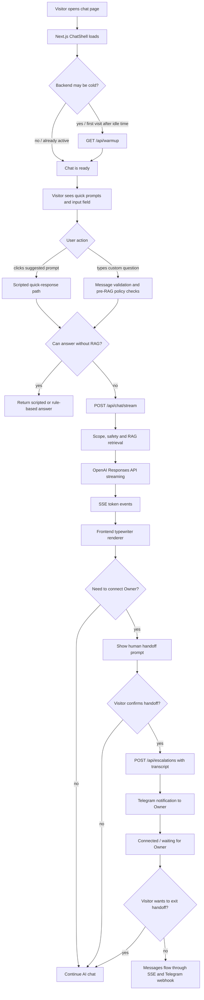
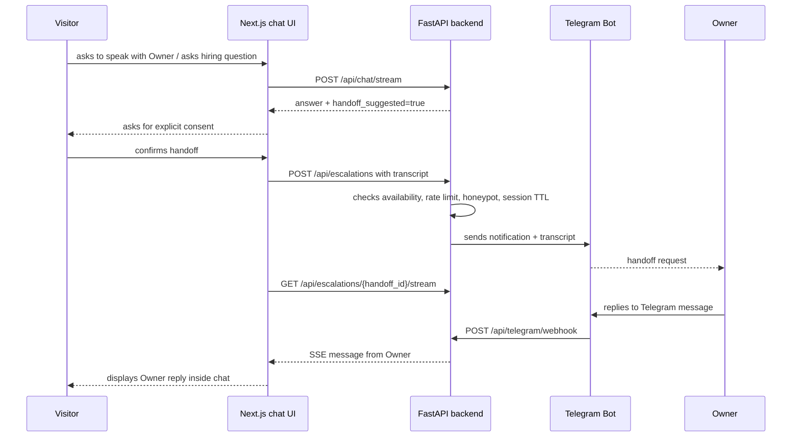
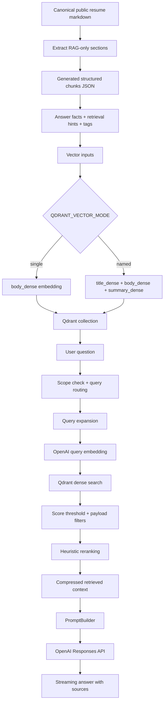
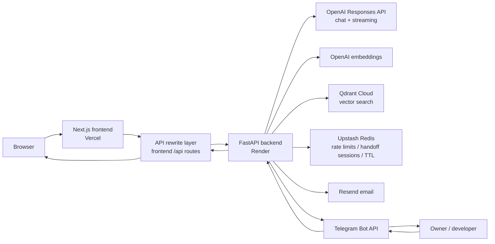

# ⚡ alextym.com — AI-powered portfolio web product with RAG Chatbot

> Documentation is available in English and Russian: [Russian version](README.ru.md).

<p align="center">
  <em>A portfolio website built as a small AI-powered web product: interactive resume, RAG chat, real SSE streaming, SEO setup, video demo, contact flow, and human handoff via Telegram.</em>
</p>

<p align="left">
  <!-- Project status -->
  <a href="https://github.com/AlexTymosh/alextym.com/actions/workflows/ci.yml"></a>
  <a href="https://opensource.org/license/mit/"></a>
</p>

<p align="left">
  <!-- Frontend -->
  <a href="https://nextjs.org/"></a>
  <a href="https://react.dev/"></a>
  <a href="https://www.typescriptlang.org/"></a>
  <a href="https://tailwindcss.com/"></a>
</p>
<p align="left">
  <!-- Backend and data -->
  <a href="https://www.python.org/"></a>
  <a href="https://fastapi.tiangolo.com/"></a>
  <a href="https://upstash.com/"></a>
</p>

<p align="left">
  <!-- AI and RAG -->
  <a href="https://openai.com/"></a>
  <a href="https://qdrant.tech/"></a>
</p>

<p align="left">
  <!-- Deployment, infrastructure, and observability -->
  <a href="https://vercel.com/"></a>
  <a href="https://render.com/"></a>
  <a href="https://www.docker.com/"></a>
  <a href="https://prometheus.io/"></a>
  <a href="https://grafana.com/"></a>
  <a href="https://grafana.com/oss/loki/"></a>
</p>

<p align="left">
  <!-- Integrations -->
  <a href="https://core.telegram.org/bots/api"></a>
</p>

---

## 🌐 Live Demo

🚀 **Frontend:** [https://alextym.com](https://alextym.com)  
⚙️ **Backend health endpoint via rewrite:** [https://alextym.com/api/health/live](https://alextym.com/api/health/live)

---

## 🖼️ Product screenshots / demos

### 1. Home page / product overview

File: `docs/assets/home-overview.png`


### 2. AI/RAG chat flow and handoff prompt

File: `docs/assets/chat-demo.gif`


### 3. Interactive resume filter

File: `docs/assets/resume-filter-demo.gif`


---

## 🧠 Overview

**alextym.com** is a portfolio website built as an **AI-powered web product**.

The website includes an AI chat, an interactive resume, a contact form, a YouTube demo, and a **human handoff** mechanism. The chat can answer questions about the website owner’s public professional profile, projects, technical skills, availability, and possible software-services collaboration. For RAG-backed answers, the backend streams OpenAI Responses API output through Server-Sent Events, while the frontend renders incoming text through a controlled typewriter buffer.

The RAG pipeline uses Qdrant + OpenAI embeddings. To improve answer quality, the following approaches are used together:

- dense vector search;
- structured generated chunks;
- metadata filters;
- query routing and query expansion;
- heuristic reranking and keyword scoring;
- configurable named dense vectors;
- parent-child-style metadata;
- `keywords_sparse` as a keyword channel for retrieval hints / scoring. This is not a full Qdrant sparse-vector index, but a practical pseudo-sparse layer on top of metadata and keyword scoring for small documents.

The chat also includes a deterministic policy layer before RAG: greetings, unsupported-language handling, private-data boundaries, prompt-injection checks, weakness/development-area boundaries, and handoff requests are handled before retrieval or LLM generation.

---

## 🧩 Tech Stack

| Category | Technologies |
|---|---|
| **Frontend** | Next.js, React, TypeScript, Tailwind CSS, CSS Modules, responsive layout, typewriter stream rendering |
| **Frontend tooling** | Node.js, npm, ESLint, Playwright |
| **Backend** | Python, FastAPI, Pydantic, Uvicorn, Server-Sent Events |
| **State / rate limiting** | Upstash Redis, in-memory fallback |
| **AI / LLM** | OpenAI Responses API, OpenAI streaming, OpenAI embeddings, configurable reasoning effort |
| **Vector DB / RAG** | Qdrant, dense vectors, configurable named dense vectors, structured chunks, metadata filters |
| **Retrieval methods** | query routing, query expansion, score thresholding, keyword scoring, heuristic reranking, source metadata, parent-child-style metadata |
| **Contact / handoff** | Resend, Telegram Bot API, Telegram webhook, SSE handoff stream, handoff sessions, TTL |
| **Safety / abuse protection** | prompt-injection checks, output guard, private-data boundary, scope routing, rate limiting, honeypot fields, no-hallucination policy |
| **SEO / SMM** | metadata, canonical URLs, OpenGraph, Twitter card, JSON-LD, sitemap.xml, robots.txt, favicon, preview indexing control |
| **Observability** | structured JSON logs, request IDs, Prometheus-compatible metrics, local Grafana/Prometheus lab, Grafana Cloud dashboards, Grafana Cloud Loki log export, LogQL |
| **Dev workflow** | Taskfile, uv, Ruff, Pytest, Docker |
| **Deployment** | Vercel frontend, Render backend, Cloudflare DNS, Qdrant Cloud |

> Node.js is used for the Next.js frontend toolchain. The backend is not built on Node.js / Express; the backend is a separate Python FastAPI service.

---

## 🚀 Main features

### 🤖 AI RAG Chatbot

- The chat is implemented as a **hybrid chat interface**: scripted responses for fast scenarios, deterministic policy handling for safety/scope cases, AI/RAG for public-knowledge answers, and human handoff for switching to the website owner.
- The AI assistant answers questions about the website owner’s public professional profile, projects, skills, CV, availability, and possible software services such as websites, automation, API integrations, internal tools, and RAG/chatbot systems.
- RAG-backed answers stream through `POST /api/chat/stream` using Server-Sent Events and OpenAI Responses API streaming.
- The frontend does not display incoming chunks immediately; it buffers SSE tokens and renders them gradually through a typewriter-style UI layer.
- If streaming is unavailable before text is received, the frontend falls back to the JSON endpoint `POST /api/chat`.
- The response includes structured metadata: `answer`, `sources`, `confidence`, `not_enough_data`, `handoff_suggested`, `handoff_reason`, `language_unsupported`, and `user_requested_human`.
- A short conversation history is used for follow-up questions and pronoun resolution, but it is not treated as a source of factual claims.
- If context is insufficient, the assistant should return a clarification-style response instead of inventing facts.

### 🔁 Bridge between the visitor and the website owner

The chat works not only as an AI bot, but also as a **bridge / handoff layer** between the visitor and the website owner.

If a question requires direct contact, clarification of availability, a hiring/collaboration discussion, or if the AI cannot provide a reliable answer, the assistant can offer to connect the website owner. If the visitor agrees:

- the current chat history is sent to the website owner as context;
- the backend creates a handoff session with TTL;
- the website owner receives a Telegram notification with transcript / context;
- the owner’s reply is returned back to the web chat through an SSE stream;
- the handoff session can be closed manually or expire by TTL;
- the interface state switches between AI mode, waiting_for_owner, connected and closed.

This turns the website from a regular portfolio into a small communication product: AI answers typical questions, while complex or hiring-related questions can be handed over to a human.

### 📄 Interactive resume

The website has a separate resume page with an interactive filter:

- detail level switch: `Concise` / `Detailed`;
- section filter: `Experience`, `Education`, `Training`;
- dynamic CV download link based on the selected detail level and sections.

### 🧾 Unlisted portfolio case study

The website also includes an unlisted portfolio case-study page for direct sharing:

- `/case-studies/netflix-catalogue-analysis`

The page is not part of the main navigation and is marked as `noindex`. It should be removed or replaced with the owner’s own case study and PDF files before reusing the template.

### ▶️ Embedded YouTube demo

The home page includes an embedded YouTube player through `youtube-nocookie.com`.

### ✉️ Contact form

- The contact form is validated on the backend.
- Email delivery is handled through Resend.
- There is a `company_website` honeypot field against simple bots.

### 🔎 SEO / SMM readiness

The website is configured as a public page that can be indexed and shown to recruiters/clients/partners:

- centralized `siteConfig` for title, description, keywords, and public routes;
- page metadata for the home page, chat page, and resume page;
- canonical URLs;
- OpenGraph metadata for LinkedIn / social previews;
- Twitter card metadata;
- JSON-LD `Person` structured data;
- `sitemap.xml` for public routes;
- `robots.txt` with indexing disallowed for `/api/`;
- preview deployments can be excluded from indexing;
- favicon and OpenGraph image are connected as part of the public presentation.

> This is not “magical SEO”, but basic technical preparation for correct indexing and social previews.

### 📊 Lighthouse / frontend quality snapshot

Manual Lighthouse measurements can be used as additional confirmation of frontend quality.
Screenshots are available at:

`docs/assets/lighthouse-summary.png`


The current JSON reports for the home page show good results for an MVP:

| Check | Device / page | Performance | Accessibility | Best Practices | SEO | Comment |
|---|---:|---:|---:|---:|---:|---|
| Navigation | Desktop `/` | 100 | 96 | 100 | 100 | Good desktop result; the report shows no noticeable blocking issues. |
| Navigation | Mobile `/` | 98 | 96 | 100 | 100 | Good mobile result; LCP remains in the green zone. |

> The website can be improved further — there are minor accessibility issues with accent/button contrast to bring Accessibility closer to 100.

### 🛡️ Safety / privacy / abuse protection

The project implements a basic protection layer:

- deterministic pre-RAG policy handling for prompt-injection attempts, private-data requests, unsupported languages, direct handoff requests, and public-boundary weakness/development-area questions;
- blocking disclosure of hidden/system/developer instructions;
- blocking “dump knowledge base” requests and attempts to answer without context;
- output guard for unsafe generated content, including hidden prompts, retrieved context markers, internal rules, and secret-like values;
- scope routing: the chat answers questions about the public professional profile, projects, services, availability, and contact/collaboration options of the website owner;
- private-data boundary: phone numbers, personal email, home address, and private details are not disclosed;
- no-hallucination policy: if context is insufficient, an insufficient-data / clarification response is returned;
- rate limiting for chat, contact, escalation, and handoff messages;
- honeypot fields for contact and escalation flows;
- Telegram webhook is protected by a secret token;
- preview deployments can be excluded from indexing.

### 🧪 Quality controls

- Backend tests through Pytest.
- Backend linting / formatting through Ruff.
- Frontend linting through ESLint.
- Frontend production build check.
- Playwright E2E tests.
- GitHub Actions CI for repository hygiene, shared config, backend, frontend, RAG checks, and Docker build.
- `task ci` for local verification before push / PR.
- Dockerfile for backend portability.
- Separate eval scripts for checking the quality of AI/RAG answers.
- Deterministic eval mode without OpenAI/Qdrant and live eval mode with real RAG.
- Eval reports can be compared in before/after format to see regressions/fixes after changes to knowledge, prompt, or retrieval logic.

### 📈 Observability / monitoring

The project includes a free / low-cost observability path built around
Prometheus-compatible metrics and Grafana dashboards:

- structured JSON backend logs with `request_id` correlation;
- optional Grafana Cloud Loki export for safe structured backend warning/error logs;
- LogQL-based troubleshooting through Grafana Explore and a backend logs dashboard;
- protected `/internal/metrics` endpoint with bearer-token authentication;
- HTTP metrics for request counts, status classes and latency;
- domain metrics for chat, RAG retrieval, LLM calls, contact, escalation,
  rate limits, page views and CV downloads;
- local Prometheus + Grafana lab for development and training;
- Grafana Cloud connection through a protected Render metrics scrape endpoint.

Metrics are disabled by default and must be enabled explicitly with:

```env
METRICS_ENABLED="true"
METRICS_TOKEN="<secret-token>"
METRICS_PATH="/internal/metrics"
```

For local training:

```bash
task obs:config
task obs:up
task obs:logs
task obs:restart
task obs:down
```

Cloud monitoring uses Grafana Cloud Metrics Endpoint scraping of the protected
Render backend metrics endpoint. Secrets and tokens are configured only in
Render / Grafana Cloud and must never be committed to the repository.

More details:

- [Grafana Cloud logs setup](docs/grafana-cloud-logs.md)

#### Grafana dashboard screenshot

File: `docs/assets/grafana-cloud-dashboard.png`


---

## 💬 How the chat works

The chat is built as a hybrid communication layer:

```text
scripted responses
  -> quick answers for typical scenarios
policy responses
  -> deterministic safety, language, handoff, privacy and boundary handling
AI/RAG responses
  -> answers based on the public knowledge base with sources/confidence metadata
human handoff
  -> escalation to the website owner via Telegram if the AI cannot cope or the question requires personal confirmation
```

### General flow



### 1. Chat opening flow

```text
Visitor opens /chat
  -> Next.js loads ChatShell
  -> frontend checks chat readiness
  -> if backend may be cold, frontend calls GET /api/warmup
  -> backend returns lightweight warmup response
  -> chat status becomes Ready
```

`/api/warmup` depends on backend idle time: it is useful after an idle period / cold start on free or low-cost hosting, where the backend may go to sleep.

> To minimise costs, the backend of this project is deployed on Render Free Tier. The free tier can put the service to sleep after inactivity. For user convenience, it is recommended to configure a cron-job or uptime monitor with a regular call to the health/warmup endpoint every 10–15 minutes.

### 2. Regular AI/RAG flow

```text
Visitor sends a message
  -> frontend sends POST /api/chat/stream
  -> backend validates message and short history
  -> backend applies deterministic pre-RAG policy checks
  -> backend decides whether RAG is needed
  -> retrieval query is built or rewritten
  -> query is routed by intent and metadata hints
  -> query expansion adds domain-specific retrieval terms
  -> OpenAI embeddings are generated for the query
  -> Qdrant returns top-k relevant chunks
  -> weak matches are filtered by score threshold
  -> chunks are reranked with dense score + topic/tag/section bonuses + keyword score
  -> prompt is built with separated system instructions and retrieved context
  -> OpenAI Responses API streams output text deltas
  -> backend applies delayed output guard while streaming
  -> SSE token events are returned to the browser
  -> frontend buffers and gradually renders tokens through a typewriter renderer
  -> sources / confidence / not_enough_data / handoff metadata are returned
```

### 3. Fallback flow

```text
If SSE stream fails before text is received
  -> frontend calls POST /api/chat
  -> backend returns normal JSON answer
  -> frontend still renders the answer for the user
```

### 4. Human handoff flow



By default, live handoff is limited to the working window `09:00–21:00 Europe/London`. Outside this window, the visitor is offered to try later or use the contact form.

Working hours can be changed in `.env`.

---

## 🧠 How RAG works



### RAG approaches used

| Method | How it is used in the project |
|---|---|
| **Public knowledge boundary** | Only verified public data is indexed; private drafts should not get into Qdrant. |
| **Structured RAG extraction** | Special RAG sections are extracted from canonical resume markdown: `Answer Facts`, `Retrieval Hints`, `Primary Tags`, `Secondary Tags`. |
| **Generated chunks JSON** | The extraction result is stored as `resume.generated.chunks.json` with schema version, source, payload, answer facts, hints, and vector inputs. |
| **Heading-aware chunking** | For regular markdown sources, chunking follows heading structure rather than arbitrary character boundaries. |
| **Dense vectors** | The main search is based on OpenAI embeddings and Qdrant dense vector search. |
| **Named dense vectors** | A configurable `QDRANT_VECTOR_MODE=named` mode is supported with `title_dense`, `body_dense`, `summary_dense`. |
| **Pseudo-sparse keyword channel** | Generated chunks include `keywords_sparse`; it is used as keyword text / retrieval hints / scoring layer, but not as a full Qdrant sparse vector index. |
| **Parent-child-style metadata** | Generated chunks store `parent_id`, and retrieval metadata includes `parent_child`; this creates a structure for linking a chunk with its parent entity. |
| **Metadata / payload filters** | Fields such as `source`, `source_file`, `section`, `topic`, `visibility`, `tags` are used; retrieval can filter by topic/tag/section hints. |
| **Query routing** | A question is classified by intent: skills, projects, services, availability, right_to_work, experience, education, contact, strengths, public_boundary, etc. |
| **Query rewriting / subject resolution** | Short follow-up questions and pronouns are rewritten into standalone Owner-focused retrieval queries. |
| **Query expansion** | For topics such as FastAPI, SQL, RAG, projects, services, strengths, and experience, additional retrieval terms are added. |
| **Score thresholding** | Weak vector matches are discarded through `RAG_SCORE_THRESHOLD`. |
| **Heuristic reranking** | After Qdrant search, chunks are sorted using dense score, topic bonus, tag bonus, section bonus, and keyword score. |
| **Keyword scoring** | Additional lexical scoring uses query terms, tags, answer facts, retrieval hints, and `keywords_sparse`. |
| **Context compression** | The prompt receives primarily `answer_facts`, not the entire source document. |
| **Prompt separation** | System instructions, retrieved context, conversation context, and user question are separated. Retrieved context is treated as data, not as instructions. |
| **No-hallucination policy** | If retrieved context is insufficient, an insufficient-data response is returned instead of a fabricated answer. |
| **Confidence scoring** | Successful RAG answers use heuristic confidence based on retrieval score, score gap, source confidence, metadata match, and answer facts. |
| **Source metadata in responses** | The response returns sources with `title`, `section`, `confidence`. |
| **Eval scripts** | There are scripts for contract/live evals, generated RAG evals, retrieval evals, and before/after comparison. |

### Limitation of the current implementation

The code includes support / metadata for several advanced retrieval ideas: `sparse`, `hybrid`, `multi_query`, `parent_child`, `context_compression`. The current runtime path performs **dense vector search through Qdrant** plus **keyword scoring / heuristic reranking**, so it is not a full sparse-vector search, but rather “hybrid-style reranking / pseudo-sparse keyword channel”. Enabling a true Qdrant sparse index separately is not necessary for a resume with biography content, but if you plan to use large documents, you should reconsider this approach.

---

## 🏗️ Architecture



> Technically, the frontend proxies requests of the form `/api/...` to the backend service. In the diagram this is shown as `API rewrite layer` to avoid using Mermaid syntax with `*`, which can break rendering in a GitHub README.

### Backend API

| Method | Endpoint | Purpose |
|---|---|---|
| `GET` | `/api/health/live` | lightweight check that the backend is alive |
| `GET` | `/api/health/ready` | configuration readiness check |
| `GET` | `/api/warmup` | lightweight backend warm-up before chat |
| `POST` | `/api/chat` | JSON fallback for chat |
| `POST` | `/api/chat/stream` | SSE chat stream for policy and RAG-backed answers |
| `POST` | `/api/contact` | contact form |
| `POST` | `/api/escalations` | handoff session creation |
| `POST` | `/api/escalations/{handoff_id}/messages` | visitor message in an active handoff session |
| `GET` | `/api/escalations/{handoff_id}/stream` | SSE stream of messages from the website owner |
| `POST` | `/api/escalations/{handoff_id}/close` | close handoff session |
| `POST` | `/api/telegram/webhook` | Telegram webhook for website owner replies |
| `POST` | `/api/analytics/events` | privacy-safe aggregate analytics events |
| `GET` | `/internal/metrics` | protected Prometheus-compatible metrics endpoint |

---

## 🟢 Keeping the website active

The project is prepared to work on free / low-cost hosting where the backend may go to sleep:

- `/api/health/live` — lightweight liveness endpoint;
- `/api/health/ready` — configuration readiness check;
- `/api/warmup` — lightweight warm-up endpoint;
- the frontend calls `/api/warmup` when `/chat` is opened;
- `/api/health/live` can be used as a target for an external keep-alive monitor.

The endpoints and the frontend warm-up request are confirmed in code. External monitoring such as UptimeRobot / cron-job.org should be configured separately if the hosting goes to sleep.

---

## 🧪 Testing & evals

### CI checks

```text
backend:
  uv sync --locked --extra dev
  ruff check
  ruff format --check
  pytest

deployment:
  BACKEND_ORIGIN-driven rewrite config check

frontend:
  npm ci
  eslint
  tsc --noEmit
  resume parser check
  next build
  playwright chromium install
  playwright e2e against the existing production build

rag:
  generated resume chunk extraction
  stateless contract eval without OpenAI/Qdrant

docker:
  backend image build
```

### AI/RAG evals

The project contains separate scripts for evaluating AI answer behaviour:

- contract evals without external OpenAI/Qdrant calls;
- live RAG evals with real retrieval;
- generated RAG quality evals;
- retrieval quality evals;
- before/after comparison reports in Markdown.

This matters for employers: AI behaviour is not only “checked manually in the browser”, but has a separate evaluation workflow for regressions.

---

## 🧑‍💻 Local development

```bash
task dev
```

Run the local Prometheus/Grafana observability lab after enabling local metrics
in `backend/.env`:

```env
METRICS_ENABLED="true"
METRICS_TOKEN="local-dev-metrics-token"
METRICS_PATH="/internal/metrics"
```

```bash
task obs:config
task obs:up
```

Open local dashboards:

- Prometheus: `http://localhost:9090`
- Grafana: `http://localhost:3001`

> Do not reuse the local metrics token in production.

Check before push / PR:

```bash
task ci
```

Edit reusable public project settings:

```bash
task setup:wizard
```

This starts a local-only GUI wizard on `127.0.0.1`. The wizard loads
`config/project.config.json`, groups editable settings by section, shows
existing values, and requires a review plus validation step before saving.
It writes only changed fields. Use it for public non-secret template settings
such as owner labels, the public website URL, public links, SEO descriptions,
social preview copy, home page copy, quick prompts, language restriction
toggles with read-only fallback previews, resume PDF link visibility, and
disclaimer page text. Resume profile text is derived from
`content/public/resume.md`.
Use `Review & Save` before writing changes, and use `Finish setup` when local
setup is finished. Keep secrets and deployment hosts in provider environment
settings.

Technical defaults such as navigation routes, footer labels, page canonical
paths, Open Graph image dimensions, and standard chat handoff/status messages
are generated by the application and are not shown in the wizard. Standard
assistant labels and boundary answers are also code-owned and use owner-name
interpolation.
Long quick-prompt responses and the disclaimer body are edited as normal
multi-line text in the GUI; the wizard saves the required JSON structure.

CLI fallback:

```bash
task setup:wizard:cli -- --list-sections
```

For local frontend development, copy the example file and adjust the backend URL if needed:

```bash
cp frontend/.env.example frontend/.env.local
```

```env
BACKEND_ORIGIN="http://localhost:8000"
```

For Vercel deployments, set the frontend environment variable in **Vercel Project Settings -> Environment Variables** for both **Preview** and **Production**:

```env
BACKEND_ORIGIN="https://alextym-backend.onrender.com"
```

The frontend still calls local `/api/*` paths. `frontend/next.config.mjs` uses `BACKEND_ORIGIN` to rewrite those requests to the backend service. The value must be the backend origin only: do not include `/api`, `/health`, or any other path. 

Rebuild generated RAG chunks:

```bash
task rag:extract-resume
```

Index generated RAG chunks in Qdrant:

```bash
task rag:ingest:generated
```

Free deterministic eval cycle:

```bash
task rag:check
```

Free before/after eval cycle:

```bash
task rag:eval:free
```

Live RAG eval cycle:

```bash
task rag:eval:paid
```

---

## 📁 Repository structure

The full project skeleton is intentionally not included in the README; see the extended documentation.

Key project areas:

```text
frontend/
  app/                 Next.js routes
  components/          UI components
  content/             public page content and resume source
  lib/                 frontend API helpers and site config

backend/
  app/api/             FastAPI routers
  app/services/        chat, contact, escalation, health, Telegram services
  app/rag/             chunking, retrieval, Qdrant store, prompt building, eval-facing logic
  app/llm/             OpenAI clients and provider abstractions
  scripts/             ingestion and evaluation scripts
  tests/               backend test suite

docs/                  architecture, API contract, RAG and deployment notes
.github/workflows/    CI pipeline
```

---

## 🧾 License

This project is licensed under the **MIT License** — feel free to use, modify, and share.

Important note: the codebase intentionally includes public developer-profile content, resume content, SEO metadata and RAG knowledge examples. If you fork or reuse this project, treat that content as a template only:

- remove the original developer’s personal/profile/resume information;
- replace public knowledge files with your own reviewed content;
- rebuild RAG chunks and re-index Qdrant;
- review SEO metadata, OpenGraph tags, JSON-LD, keywords and page descriptions;
- check that the positioning matches your target roles and does not accidentally advertise the wrong skills;
- remove or replace personal links, profile images, YouTube video IDs and public CV files;
- remove or replace unlisted case-study routes and related PDF files.

In short: the software is reusable under MIT, but the personal biography/resume/SEO content should be replaced before reuse.
