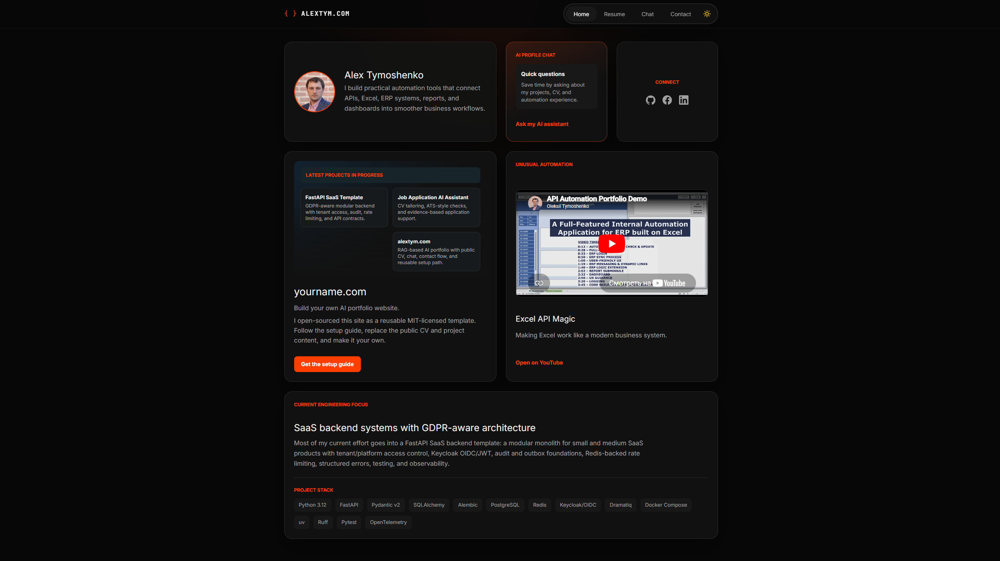
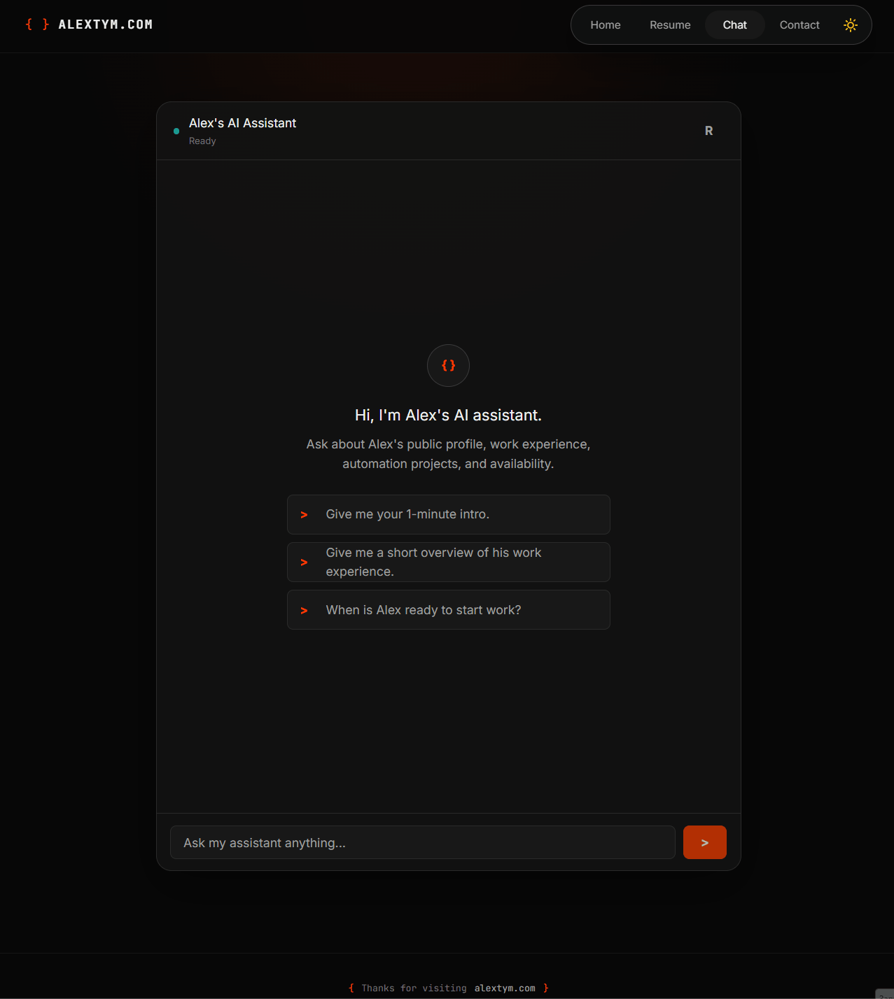
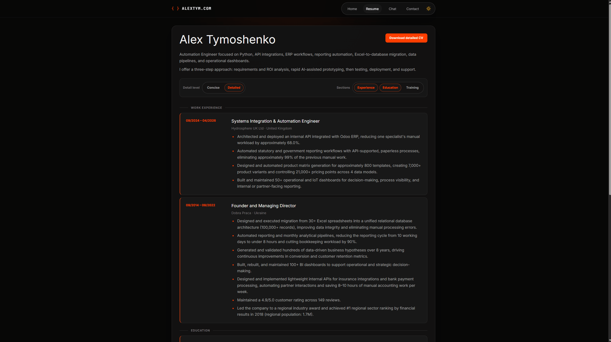
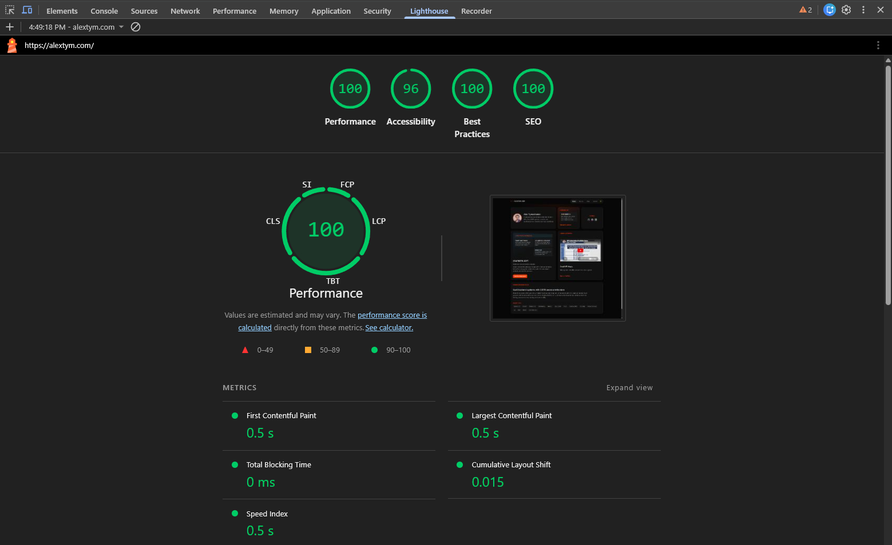
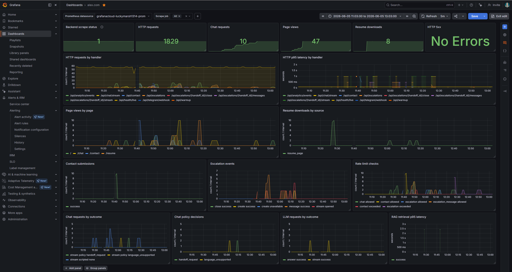
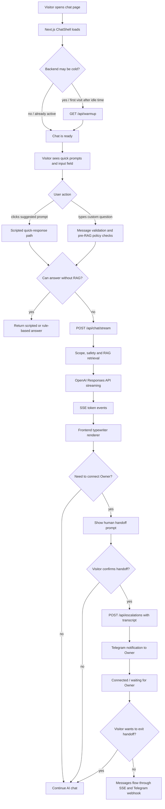
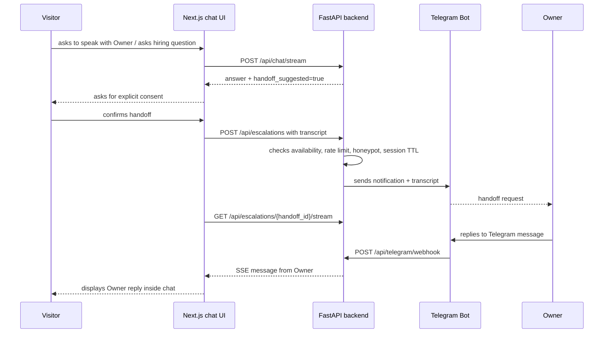
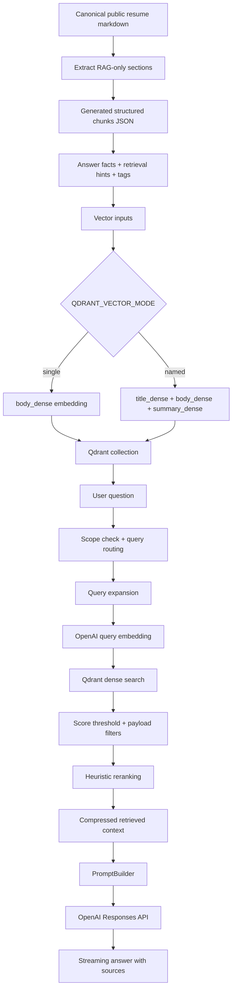
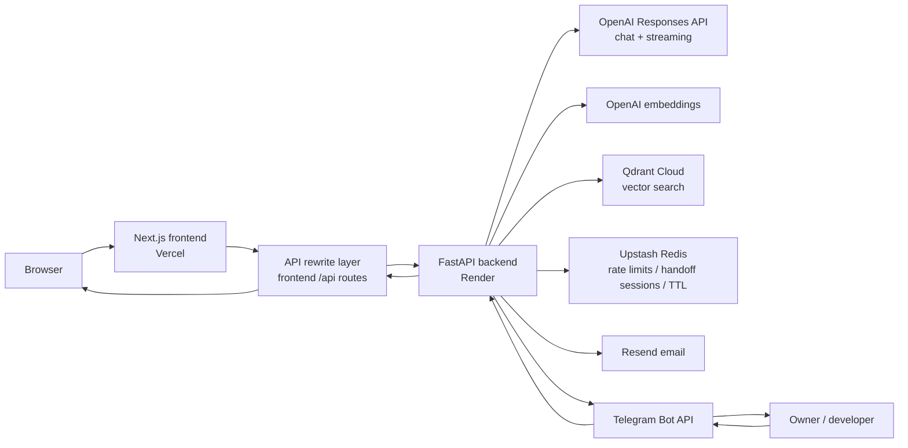

# ⚡ alextym.com — AI-powered portfolio web product with RAG Chatbot

> 🇬🇧 English version: [README.md](README.md)

<p align="center">
  <em>Portfolio-сайт, сделанный как небольшой AI-powered web product: интерактивное резюме, RAG-чат, SSE streaming, SEO-настройка, video demo, contact flow и human handoff через Telegram.</em>
</p>

<p align="center">
  <a href="https://github.com/AlexTymosh/alextym.com/actions/workflows/ci.yml"></a>
  <a href="https://opensource.org/license/mit/"></a>

  <a href="https://nextjs.org/"></a>
  <a href="https://react.dev/"></a>
  <a href="https://www.typescriptlang.org/"></a>
  <a href="https://tailwindcss.com/"></a>
  <a href="https://www.python.org/"></a>
  <a href="https://fastapi.tiangolo.com/"></a>
  <a href="https://openai.com/"></a>
  <a href="https://qdrant.tech/"></a>
  <a href="https://vercel.com/"></a>
  <a href="https://render.com/"></a>
  <a href="https://www.docker.com/"></a>
  <a href="https://prometheus.io/"></a>
  <a href="https://grafana.com/"></a>
  <a href="https://grafana.com/oss/loki/"></a>
  <a href="https://upstash.com/"></a>
  <a href="https://core.telegram.org/bots/api"></a>
</p>

---

## 🌐 Live Demo

🚀 **Frontend:** [https://alextym.com](https://alextym.com)  
⚙️ **Backend health endpoint:** [https://alextym-backend.onrender.com/api/health/live](https://alextym-backend.onrender.com/api/health/live)

---

## 🖼️ Product screenshots / demos

### 1. Главная страница / product overview

Файл: `docs/assets/home-overview.png`



### 2. Работа AI/RAG-чата и handoff-подсказки

Файл: `docs/assets/chat-demo.gif`



### 3. Интерактивный resume-фильтр

Файл: `docs/assets/resume-filter-demo.gif`



---

## 🧠 Overview

**alextym.com** — это portfolio-сайт, сделанный как **AI-powered web product**.

На сайте есть AI-чат, интерактивное резюме, contact form, YouTube demo и механизм **human handoff**. Чат может отвечать на вопросы о публичном профессиональном профиле владельца сайта, проектах, технических навыках, доступности и возможном сотрудничестве по software services. Для RAG-ответов backend передаёт поток OpenAI Responses API через Server-Sent Events, а frontend выводит входящий текст через контролируемый typewriter buffer.

RAG-пайплайн использует Qdrant + OpenAI embeddings. Для повышения качества ответов используются:

- dense vector search;
- structured generated chunks;
- metadata filters;
- query routing и query expansion;
- heuristic reranking и keyword scoring;
- configurable named dense vectors;
- parent-child-style metadata;
- `keywords_sparse` как keyword channel для retrieval hints / scoring. Это не полноценный Qdrant sparse-vector index, а практичный pseudo-sparse слой поверх metadata и keyword scoring для малых документов.

В чате также есть deterministic policy layer до RAG: greetings, unsupported-language handling, private-data boundaries, prompt-injection checks, weakness/development-area boundary и handoff requests обрабатываются до retrieval или LLM generation.

---

## 🧩 Tech Stack

| Категория | Технологии |
|---|---|
| **Frontend** | Next.js, React, TypeScript, Tailwind CSS, CSS Modules, responsive layout, typewriter stream rendering |
| **Frontend tooling** | Node.js, npm, ESLint, Playwright |
| **Backend** | Python, FastAPI, Pydantic, Uvicorn, Server-Sent Events |
| **State / rate limiting** | Upstash Redis, in-memory fallback |
| **AI / LLM** | OpenAI Responses API, OpenAI streaming, OpenAI embeddings, configurable reasoning effort |
| **Vector DB / RAG** | Qdrant, dense vectors, configurable named dense vectors, structured chunks, metadata filters |
| **Retrieval methods** | query routing, query expansion, score thresholding, keyword scoring, heuristic reranking, source metadata, parent-child-style metadata |
| **Contact / handoff** | Resend, Telegram Bot API, Telegram webhook, SSE handoff stream, handoff sessions, TTL |
| **Safety / abuse protection** | prompt-injection checks, output guard, private-data boundary, scope routing, rate limiting, honeypot fields, no-hallucination policy |
| **SEO / SMM** | metadata, canonical URLs, OpenGraph, Twitter card, JSON-LD, sitemap.xml, robots.txt, favicon, preview indexing control |
| **Observability** | structured JSON logs, request IDs, Prometheus-compatible metrics, local Grafana/Prometheus lab, Grafana Cloud dashboards, Grafana Cloud Loki log export, LogQL |
| **Dev workflow** | Taskfile, uv, Ruff, Pytest, Docker |
| **Deployment** | Vercel frontend, Render backend, Cloudflare DNS, Qdrant Cloud |

> Node.js используется для Next.js frontend toolchain. Backend не построен на Node.js / Express; backend — это отдельный Python FastAPI service.

---

## 🚀 Основные возможности

### 🤖 AI RAG Chatbot

- Чат реализован как **hybrid chat interface**: scripted responses для быстрых сценариев, deterministic policy handling для safety/scope случаев, AI/RAG для ответов по публичной базе знаний и human handoff для перехода к владельцу сайта.
- AI-ассистент отвечает на вопросы о публичном профессиональном профиле, проектах, skills, CV, availability и возможных software services: websites, automation, API integrations, internal tools и RAG/chatbot systems.
- RAG-ответы идут через `POST /api/chat/stream` с использованием Server-Sent Events и OpenAI Responses API streaming.
- Frontend не показывает chunks сразу; он буферизирует SSE tokens и постепенно выводит текст через typewriter-style UI layer.
- Если streaming недоступен до получения текста, frontend использует JSON endpoint `POST /api/chat`.
- Ответ содержит structured metadata: `answer`, `sources`, `confidence`, `not_enough_data`, `handoff_suggested`, `handoff_reason`, `language_unsupported`, `user_requested_human`.
- Короткая история диалога используется для follow-up вопросов и pronoun resolution, но не является источником фактов.
- Если контекста недостаточно, ассистент должен вернуть clarification-style response вместо выдуманного ответа.

### 🔁 Мост между посетителем и владельцем сайта

Чат работает не только как AI-бот, но и как **bridge / handoff layer** между посетителем и владельцем сайта.

Если вопрос требует прямого контакта, уточнения доступности, hiring/collaboration discussion или AI не может дать надёжный ответ, ассистент может предложить подключить владельца сайта. При согласии посетителя:

- история текущего чата передаётся владельцу сайта как контекст;
- backend создаёт handoff session с TTL;
- владелец сайта получает Telegram notification с transcript / context;
- ответ владельца возвращается обратно в web chat через SSE stream;
- handoff-сессия может быть закрыта вручную или истечь по TTL;
- состояние интерфейса переключается между AI mode, waiting_for_owner, connected и closed.

Это превращает сайт из обычного portfolio в небольшой communication product: AI отвечает на типовые вопросы, а сложные или hiring-related вопросы можно передать человеку.

### 📄 Интерактивное резюме

На сайте есть отдельная resume page с интерактивным фильтром:

- переключение уровня детализации: `Concise` / `Detailed`;
- фильтр секций: `Experience`, `Education`, `Training`;
- dynamic CV download link на основе выбранного уровня детализации и выбранных секций.

### 🧾 Непубличная portfolio case-study страница

На сайте также есть непубличная portfolio case-study страница для прямой отправки по ссылке:

- `/case-studies/netflix-catalogue-analysis`

Страница не добавлена в основную навигацию и помечена как `noindex`. Перед переиспользованием шаблона её нужно удалить или заменить на собственный case study и PDF-файлы владельца проекта.

### ▶️ Встроенное YouTube demo

На главной странице встроен YouTube-плеер через `youtube-nocookie.com`.

### ✉️ Contact form

- Форма связи валидируется на backend.
- Отправка email выполняется через Resend.
- Есть honeypot-поле `company_website` против простых ботов.

### 🔎 SEO / SMM readiness

Сайт настроен как публичная страница, которую можно индексировать и показывать рекрутёрам/заказчикам/партнёрам:

- centralized `siteConfig` для title, description, keywords и public routes;
- page metadata для главной страницы, chat page и resume page;
- canonical URLs;
- OpenGraph metadata для LinkedIn / social previews;
- Twitter card metadata;
- JSON-LD `Person` structured data;
- `sitemap.xml` для public routes;
- `robots.txt` с запретом индексации `/api/`;
- preview deployments могут быть исключены из индексации;
- favicon и OpenGraph image подключены как часть публичной презентации.

> Это не “магическое SEO”, а базовая техническая подготовка к корректной индексации и social previews.

### 📊 Lighthouse / frontend quality snapshot

Ручные замеры Lighthouse можно использовать как дополнительное подтверждение качества frontend.
Скриншоты доступны по пути:

`docs/assets/lighthouse-summary.png`



Текущие JSON-отчёты для главной страницы показывают хорошие результаты для MVP:

| Проверка | Device / page | Performance | Accessibility | Best Practices | SEO | Комментарий |
|---|---:|---:|---:|---:|---:|---|
| Navigation | Desktop `/` | 100 | 96 | 100 | 100 | Хороший desktop result; заметных blocking-проблем в отчёте нет. |
| Navigation | Mobile `/` | 98 | 96 | 100 | 100 | Хороший mobile result; LCP остаётся в зелёной зоне. |

> Cайт можно улучшить — есть мелкие accessibility issues с контрастом accent/button.

### 🛡️ Safety / privacy / abuse protection

В проекте реализован базовый защитный слой:

- deterministic pre-RAG policy handling для prompt-injection attempts, private-data requests, unsupported languages, direct handoff requests и public-boundary weakness/development-area вопросов;
- запрет на раскрытие hidden/system/developer instructions;
- запрет на “dump knowledge base” и попытки отвечать без контекста;
- output guard для unsafe generated content, включая hidden prompts, retrieved context markers, internal rules и secret-like values;
- scope routing: чат отвечает на вопросы о публичном профессиональном профиле, проектах, services, availability и contact/collaboration options владельца сайта;
- private-data boundary: phone numbers, personal email, home address и private details не раскрываются;
- no-hallucination policy: если контекста недостаточно, возвращается insufficient-data / clarification response;
- rate limiting для chat, contact, escalation и handoff messages;
- honeypot fields для contact и escalation flows;
- Telegram webhook защищён secret token;
- preview deployments могут быть исключены из индексации.

### 🧪 Quality controls

- Backend tests через Pytest.
- Backend linting / formatting через Ruff.
- Frontend linting через ESLint.
- Frontend production build check.
- Playwright E2E tests.
- GitHub Actions CI для backend и frontend.
- `task ci` для локальной проверки перед push / PR.
- Dockerfile для backend portability.
- Отдельные eval scripts для проверки качества AI/RAG-ответов.
- Есть deterministic eval режим без OpenAI/Qdrant и live eval режим с реальным RAG.
- Eval reports можно сравнивать в формате before/after, чтобы видеть regressions/fixes после изменения knowledge, prompt или retrieval logic.

### 📈 Observability / monitoring

В проекте есть бесплатный / низкобюджетный observability path на основе
Prometheus-compatible metrics и Grafana dashboards:

- structured JSON backend logs с `request_id` correlation;
- optional Grafana Cloud Loki export для безопасных structured backend warning/error logs;
- LogQL-based troubleshooting через Grafana Explore и backend logs dashboard;
- защищённый `/internal/metrics` endpoint с bearer-token authentication;
- HTTP metrics для количества запросов, status classes и latency;
- domain metrics для chat, RAG retrieval, LLM calls, contact, escalation,
  rate limits, page views и CV downloads;
- локальная Prometheus + Grafana lab для разработки и тренировки;
- подключение Grafana Cloud через защищённый Render metrics scrape endpoint.

Metrics выключены по умолчанию и должны включаться явно:

```env
METRICS_ENABLED="true"
METRICS_TOKEN="<secret-token>"
METRICS_PATH="/internal/metrics"
```

Для локальной тренировки:

```bash
task obs:config
task obs:up
task obs:logs
task obs:restart
task obs:down
```

Cloud monitoring использует Grafana Cloud Metrics Endpoint scraping защищённого
Render backend metrics endpoint. Secrets и tokens настраиваются только в Render /
Grafana Cloud и не должны попадать в репозиторий.

Подробнее:

- [Grafana Cloud logs setup](docs/grafana-cloud-logs.ru.md)

#### Скриншот Grafana dashboard

Файл: `docs/assets/grafana-cloud-dashboard.png`



---

## 💬 Как работает чат

Чат построен как гибридный communication layer:

```text
scripted responses
  -> быстрые ответы для типовых сценариев
policy responses
  -> deterministic safety, language, handoff, privacy и boundary handling
AI/RAG responses
  -> ответы по публичной базе знаний с sources/confidence metadata
human handoff
  -> эскалация на владельца сайта через Telegram, если AI не справляется или вопрос требует личного подтверждения
```

### Общая схема



### 1. Поток открытия чата

```text
Visitor opens /chat
  -> Next.js loads ChatShell
  -> frontend checks chat readiness
  -> if backend may be cold, frontend calls GET /api/warmup
  -> backend returns lightweight warmup response
  -> chat status becomes Ready
```

`/api/warmup` зависит от времени простоя backend: он полезен после idle period / cold start на free или low-cost hosting, где backend может засыпать.

> Backend данного проекта для минимизации затрат размещён на Render Free Tier. Бесплатный тариф может усыплять сервис после неактивности. Для удобства пользователей рекомендуется настроить cron-job или uptime monitor с регулярным вызовом health/warmup endpoint каждые 10–15 минут.

### 2. Обычный AI/RAG-поток

```text
Visitor sends a message
  -> frontend sends POST /api/chat/stream
  -> backend validates message and short history
  -> backend applies deterministic pre-RAG policy checks
  -> backend decides whether RAG is needed
  -> retrieval query is built or rewritten
  -> query is routed by intent and metadata hints
  -> query expansion adds domain-specific retrieval terms
  -> OpenAI embeddings are generated for the query
  -> Qdrant returns top-k relevant chunks
  -> weak matches are filtered by score threshold
  -> chunks are reranked with dense score + topic/tag/section bonuses + keyword score
  -> prompt is built with separated system instructions and retrieved context
  -> OpenAI Responses API streams output text deltas
  -> backend applies delayed output guard while streaming
  -> SSE token events are returned to the browser
  -> frontend buffers and gradually renders tokens through a typewriter renderer
  -> sources / confidence / not_enough_data / handoff metadata are returned
```

### 3. Fallback-поток

```text
If SSE stream fails before text is received
  -> frontend calls POST /api/chat
  -> backend returns normal JSON answer
  -> frontend still renders the answer for the user
```

### 4. Human handoff-поток



По умолчанию live handoff ограничен рабочим окном `09:00–21:00 Europe/London`. Вне этого окна посетителю предлагается попробовать позже или использовать contact form.

Настройки рабочего времени можно изменить в `.env`.

---

## 🧠 Как работает RAG



### Использованные RAG-решения

| Метод | Как используется в проекте |
|---|---|
| **Public knowledge boundary** | Индексируются только проверенные публичные данные; приватные черновики не должны попадать в Qdrant. |
| **Structured RAG extraction** | Из canonical resume markdown извлекаются специальные RAG-секции: `Answer Facts`, `Retrieval Hints`, `Primary Tags`, `Secondary Tags`. |
| **Generated chunks JSON** | Результат extraction сохраняется как `resume.generated.chunks.json` со schema version, source, payload, answer facts, hints и vector inputs. |
| **Heading-aware chunking** | Для обычных markdown-источников есть chunking по структуре заголовков, а не по случайным символам. |
| **Dense vectors** | Основной поиск построен на OpenAI embeddings и Qdrant dense vector search. |
| **Named dense vectors** | Поддерживается configurable режим `QDRANT_VECTOR_MODE=named` с `title_dense`, `body_dense`, `summary_dense`. |
| **Pseudo-sparse keyword channel** | В generated chunks есть `keywords_sparse`; он используется как keyword text / retrieval hints / scoring layer, но не как полноценный Qdrant sparse vector index. |
| **Parent-child-style metadata** | В generated chunks хранится `parent_id`, а retrieval metadata содержит `parent_child`; это создаёт структуру для связки chunk с parent entity. |
| **Metadata / payload filters** | Используются поля `source`, `source_file`, `section`, `topic`, `visibility`, `tags`; retrieval может фильтровать по topic/tag/section hints. |
| **Query routing** | Вопрос классифицируется по intent: skills, projects, services, availability, right_to_work, experience, education, contact, strengths, public_boundary и др. |
| **Query rewriting / subject resolution** | Короткие follow-up вопросы и pronouns переписываются в standalone Owner-focused retrieval query. |
| **Query expansion** | Для тем вроде FastAPI, SQL, RAG, projects, services, strengths, experience добавляются дополнительные retrieval terms. |
| **Score thresholding** | Слабые vector matches отбрасываются через `RAG_SCORE_THRESHOLD`. |
| **Heuristic reranking** | После Qdrant search chunks сортируются с учётом dense score, topic bonus, tag bonus, section bonus и keyword score. |
| **Keyword scoring** | Дополнительный lexical scoring использует query terms, tags, answer facts, retrieval hints и `keywords_sparse`. |
| **Context compression** | В prompt передаются прежде всего `answer_facts`, а не весь исходный документ. |
| **Prompt separation** | System instructions, retrieved context, conversation context и user question разделены. Retrieved context трактуется как data, не как instructions. |
| **No-hallucination policy** | Если retrieved context недостаточен, возвращается insufficient-data response вместо выдуманного ответа. |
| **Confidence scoring** | Успешные RAG-ответы используют heuristic confidence на основе retrieval score, score gap, source confidence, metadata match и answer facts. |
| **Source metadata in responses** | Ответ возвращает источники с `title`, `section`, `confidence`. |
| **Eval scripts** | Есть scripts для contract/live evals, generated RAG evals, retrieval evals и before/after comparison. |

### Ограничение текущей реализации

В коде есть support / metadata для нескольких advanced retrieval ideas: `sparse`, `hybrid`, `multi_query`, `parent_child`, `context_compression`. Текущий runtime path выполняет **dense vector search через Qdrant** плюс **keyword scoring / heuristic reranking**, поэтому это не полноценный sparse-vector search, а “hybrid-style reranking / pseudo-sparse keyword channel”. Отдельно включать настоящий Qdrant sparse index для резюме с биографией не обязательно, но для больших документов подход нужно пересмотреть.

---

## 🏗️ Architecture



> Технически frontend проксирует запросы вида `/api/...` на backend service. В диаграмме это обозначено как `API rewrite layer`, чтобы не использовать Mermaid-синтаксис с `*`, который может ломать rendering в GitHub README.

### Backend API

| Method | Endpoint | Назначение |
|---|---|---|
| `GET` | `/api/health/live` | лёгкая проверка, что backend жив |
| `GET` | `/api/health/ready` | readiness check конфигурации |
| `GET` | `/api/warmup` | лёгкий прогрев backend перед чатом |
| `POST` | `/api/chat` | JSON fallback для чата |
| `POST` | `/api/chat/stream` | SSE chat stream для policy и RAG-backed ответов |
| `POST` | `/api/contact` | contact form |
| `POST` | `/api/escalations` | создание handoff session |
| `POST` | `/api/escalations/{handoff_id}/messages` | сообщение посетителя в активной handoff-сессии |
| `GET` | `/api/escalations/{handoff_id}/stream` | SSE stream сообщений от владельца сайта |
| `POST` | `/api/escalations/{handoff_id}/close` | закрытие handoff-сессии |
| `POST` | `/api/telegram/webhook` | Telegram webhook для ответов владельца сайта |
| `POST` | `/api/analytics/events` | privacy-safe aggregate analytics events |
| `GET` | `/internal/metrics` | защищённый Prometheus-compatible metrics endpoint |

---

## 🟢 Поддержание активности сайта

Проект подготовлен для работы на free / low-cost hosting, где backend может засыпать:

- `/api/health/live` — лёгкий liveness endpoint;
- `/api/health/ready` — readiness check конфигурации;
- `/api/warmup` — лёгкий warm-up endpoint;
- frontend вызывает `/api/warmup` при открытии `/chat`;
- `/api/health/live` можно использовать как target для внешнего keep-alive monitor.

В коде подтверждены endpoints и frontend warm-up request. Внешний мониторинг вроде UptimeRobot / cron-job.org должен быть настроен отдельно, если hosting засыпает.

---

## 🧪 Testing & evals

### CI checks

```text
backend:
  uv sync --locked --extra dev
  ruff check
  ruff format --check
  pytest

frontend:
  npm ci
  eslint
  next build
  playwright chromium install
  playwright e2e
```

### AI/RAG evals

Проект содержит отдельные scripts для оценки поведения AI-ответов:

- contract evals без внешних OpenAI/Qdrant вызовов;
- live RAG evals с реальным retrieval;
- generated RAG quality evals;
- retrieval quality evals;
- before/after comparison reports в Markdown.

Это важно для работодателя: AI-поведение не только “проверяется вручную в браузере”, а имеет отдельный evaluation workflow для регрессий.

---

## 🧑‍💻 Local development

```bash
task dev
```

Local Prometheus/Grafana observability lab запускается после включения local
metrics в `backend/.env`:

```env
METRICS_ENABLED="true"
METRICS_TOKEN="local-dev-metrics-token"
METRICS_PATH="/internal/metrics"
```

```bash
task obs:config
task obs:up
```

Локальные dashboards:

- Prometheus: `http://localhost:9090`
- Grafana: `http://localhost:3001`

Не используй local metrics token в production.

Проверка перед push / PR:

```bash
task ci
```

Пересборка generated RAG chunks:

```bash
task rag:extract-resume
```

Индексация generated RAG chunks в Qdrant:

```bash
task rag:ingest:generated
```

Free deterministic eval cycle:

```bash
task rag:eval:free
```

Live RAG eval cycle:

```bash
task rag:eval:paid
```

---

## 📁 Repository structure

Полный skeleton проекта намеренно не вынесен в README, смотри расширенную документацию.

Ключевые зоны проекта:

```text
frontend/
  app/                 Next.js routes
  components/          UI components
  content/             public page content and resume source
  lib/                 frontend API helpers and site config

backend/
  app/api/             FastAPI routers
  app/services/        chat, contact, escalation, health, Telegram services
  app/rag/             chunking, retrieval, Qdrant store, prompt building, eval-facing logic
  app/llm/             OpenAI clients and provider abstractions
  scripts/             ingestion and evaluation scripts
  tests/               backend test suite

docs/                  architecture, API contract, RAG and deployment notes
.github/workflows/    CI pipeline
```

---

## 🧾 License

This project is licensed under the **MIT License** — feel free to use, modify, and share.

Important note: the codebase intentionally includes public developer-profile content, resume content, SEO metadata and RAG knowledge examples. If you fork or reuse this project, treat that content as a template only:

- remove the original developer’s personal/profile/resume information;
- replace public knowledge files with your own reviewed content;
- rebuild RAG chunks and re-index Qdrant;
- review SEO metadata, OpenGraph tags, JSON-LD, keywords and page descriptions;
- check that the positioning matches your target roles and does not accidentally advertise the wrong skills;
- remove or replace personal links, profile images, YouTube video IDs and public CV files;
- remove or replace unlisted case-study routes and related PDF files.

In short: the software is reusable under MIT, but the personal biography/resume/SEO content should be replaced before reuse.
