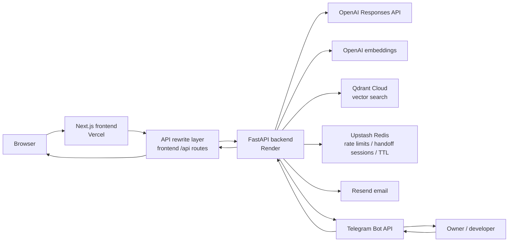
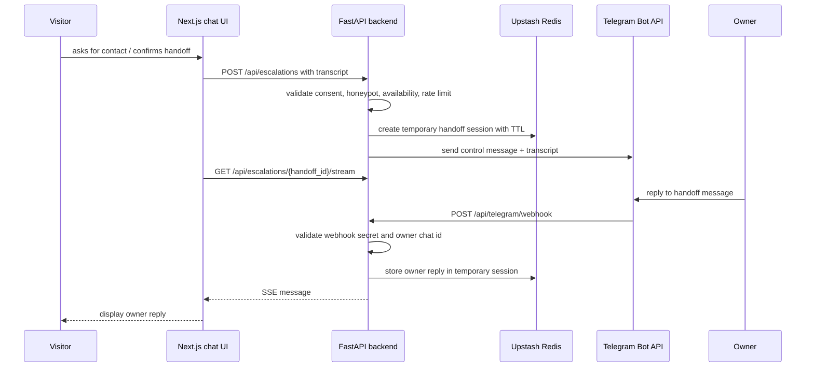

# Architecture

## Purpose

This project is `alextym.com`, a portfolio website built as a small AI-powered web product.

The website demonstrates:

- a Next.js / React frontend;
- a Python FastAPI backend;
- a RAG-based AI assistant;
- hybrid chat UX with scripted quick prompts, AI/RAG answers, and human handoff;
- streaming responses through Server-Sent Events;
- an interactive resume page with filtered PDF generation;
- a Telegram-based bridge between the visitor and the site owner;
- privacy-aware handling of public professional profile data;
- deployable low-cost architecture.

The site is not only a static portfolio. The main product feature is a hybrid assistant that answers employer-facing questions about the site owner's public professional profile and can escalate to a human when direct contact or confirmation is needed.

---

## Product scope

Implemented public routes:

```text
/          -> home page / product overview
/resume    -> interactive resume + dynamic CV download
/chat      -> AI/RAG chat + human handoff
/contact   -> contact form
```

Main navigation currently includes:

```text
Home
Resume
Chat
Contact
```

The canonical public routes are also used by `sitemap.xml`:

```text
/
 /resume
 /chat
 /contact
```

---

## Frontend application

Frontend stack:

```text
Next.js
React
TypeScript
Tailwind CSS
CSS Modules
Node.js / npm toolchain
Playwright for E2E checks
ESLint
```

Important clarification:

```text
Node.js is used for the Next.js frontend toolchain.
The backend is not a Node.js / Express service.
The backend is a separate Python FastAPI application.
```

The home page includes:

- product overview blocks;
- connect/contact entry points;
- embedded YouTube demo through `youtube-nocookie.com`;
- SEO/SMM metadata inherited from the Next.js metadata configuration.

The resume page includes:

- detail level switch: `Concise` / `Detailed`;
- section filter: `Experience`, `Education`, `Training`;
- dynamic PDF download route: `/resume/download?detail=...&sections=...`.

---

## Chat UX

The chat is implemented as a hybrid communication layer.

### Empty chat state

The current UI starts with an assistant intro, a short explanation, and quick-prompt buttons.

Quick prompt labels currently implemented in the frontend:

```text
Give me your 1-minute intro.
Give me a short overview of his work experience.
When is Alex ready to start work?
```

These quick prompts use frontend scripted responses. They do not call the AI/RAG endpoint.

### Typed message flow

Typed messages follow this path:

```text
Visitor types a message
  -> frontend checks whether an active handoff session exists
  -> if handoff is active, message goes to the handoff message endpoint
  -> otherwise frontend checks local handoff request / confirmation patterns
  -> if not handled locally, frontend calls POST /api/chat/stream
  -> if streaming fails before any text arrives, frontend falls back to POST /api/chat
```

The frontend sends only a short conversation history for follow-up and pronoun handling. This history is not treated as a source of factual claims.

---

## Backend stack

Backend stack:

```text
Python
FastAPI
Pydantic
Uvicorn
OpenAI Python SDK
Qdrant client
Resend SDK
Upstash Redis REST API through HTTP calls
```

Backend entry point:

```text
backend/app/main.py
```

Registered API routers under `/api`:

```text
health
chat
contact
escalation
telegram
```

Current backend layering:

```text
backend/app/api/        -> FastAPI routers and HTTP-level error mapping
backend/app/schemas/    -> Pydantic request/response models and validation limits
backend/app/services/   -> business workflows: chat, contact, escalation, health, Telegram, rate limiting
backend/app/rag/        -> chunking, generated RAG source extraction, retrieval, Qdrant store, prompt building
backend/app/llm/        -> OpenAI Responses API and embeddings clients
backend/app/core/       -> configuration
```

Keep routers thin. Most orchestration belongs in services, and RAG-specific logic belongs in `backend/app/rag/`.

---

## High-level architecture



The frontend calls local `/api/...` paths. `frontend/next.config.mjs` creates
the production rewrite from the `BACKEND_ORIGIN` environment variable.

Current rewrite shape:

```text
/api/:path* -> ${BACKEND_ORIGIN}/api/:path*
```

---

## Shared project configuration

Reusable public template settings live in:

```text
config/project.config.json
```

This config contains non-secret project identity, public links, SEO
descriptions, social preview copy, home page copy, language restriction
toggles, quick prompts, resume page labels, resume PDF link visibility, and
disclaimer page text. Assistant labels are derived from owner names.

Local editing is handled through:

```bash
task setup:wizard
```

The wizard loads the existing config, shows editable fields from
`wizard.editableSections`, groups settings by tab, patches changed fields only,
and requires review plus validation before saving. The CLI fallback is available
through:

```bash
task setup:wizard:cli
```

The local GUI wizard intentionally exposes only common template settings.
Contact-form implementation copy and technical honeypot fields remain in
project config for runtime use, but are not shown in the wizard by default.
Resume settings shown in the wizard are limited to the page heading, download
file base name, PDF display name, and PDF link visibility. Resume page intro
text and PDF profile text are derived from `content/public/resume.md`.

Technical site defaults are code-owned rather than wizard-owned: navigation
routes, footer boilerplate, HTML language, page canonical paths, JSON-LD
`Person` type, Open Graph image dimensions, and standard chat handoff/status
messages are derived by the application. Standard assistant boundary answers
and assistant labels are also code-owned and interpolate owner names. The
wizard edits the owner name, canonical website URL, public links, SEO
descriptions, quick prompts, language restriction toggles with read-only
fallback previews, home content, resume PDF link visibility, and disclaimer text.
Long quick-prompt responses and the disclaimer body are edited as multi-line
text in the GUI while the wizard preserves the required JSON config structure.

Do not put secrets, provider credentials, deployment-specific backend hosts, or
private biography data in project config. Deployment hosts stay in provider
environment variables. Public resume and public RAG content stay in:

```text
content/public/resume.md
```

The backend RAG extractor and loaders resolve that file through
`content.publicResumePath` in `config/project.config.json`. Do not add a second
hardcoded resume source path in backend code.

---

## Backend API surface

Implemented backend endpoints:

```text
GET  /api/health/live
GET  /api/health/ready
GET  /api/warmup

POST /api/chat
POST /api/chat/stream

POST /api/contact

POST /api/escalations
POST /api/escalations/{handoff_id}/messages
GET  /api/escalations/{handoff_id}/stream
POST /api/escalations/{handoff_id}/close

POST /api/telegram/webhook
```

---

## Chat and RAG flow

```text
POST /api/chat or POST /api/chat/stream
  -> ChatRequest validation
  -> daily rate limit
  -> prompt-injection phrase checks
  -> explicit handoff request check
  -> unsupported-language check
  -> private-data request check
  -> greeting/help/assistant-intro/social acknowledgement shortcut checks
  -> question resolution
  -> retrieval query rewrite when needed
  -> Qdrant retrieval
  -> prompt building with separated system/context/question
  -> OpenAI Responses API answer
  -> structured ChatResponse or SSE events
```

If no useful chunks are retrieved or provider calls fail, the chat returns an insufficient-data response instead of exposing provider errors or fabricating an answer.

The current runtime RAG path is:

```text
query routing
  -> query expansion
  -> OpenAI query embedding
  -> Qdrant dense vector search
  -> payload filters
  -> score threshold
  -> section filtering
  -> heuristic reranking
  -> keyword scoring
  -> prompt context with compressed answer facts where available
```

---

## Human handoff architecture



A visitor can send follow-up messages during an active handoff:

```text
browser
  -> POST /api/escalations/{handoff_id}/messages
  -> backend validates active session
  -> backend forwards the visitor message to Telegram
```

A visitor can close the active handoff:

```text
browser
  -> POST /api/escalations/{handoff_id}/close
  -> backend marks the session as closed
  -> new visitor messages return to normal AI chat flow
```

Current handoff states:

```text
idle
waiting_for_alex
connected
closed
error
```

Live handoff availability is configurable by environment variables:

```text
HANDOFF_AVAILABILITY_ENABLED
HANDOFF_AVAILABILITY_TIMEZONE
HANDOFF_AVAILABILITY_START
HANDOFF_AVAILABILITY_END
```

Current defaults:

```text
Europe/London
09:00
21:00
```

---

## RAG instead of fine-tuning

This project uses RAG, not fine-tuning.

Reasons:

- the knowledge base is small and profile-specific;
- updates should be simple;
- facts must remain grounded in reviewed public source content;
- RAG is easier to test with retrieval and answer evals;
- fine-tuning is unnecessary for this portfolio/product scope.

---

## Current non-goals

These are intentionally out of scope for the current implementation:

- user accounts;
- authentication;
- admin panel;
- CMS;
- blog;
- Keycloak;
- SaaS-style multi-tenancy;
- paid tiers;
- local ChromaDB inside the backend container;
- fine-tuning;
- long-term chat history storage.

The project does have temporary handoff session storage through Upstash Redis TTL. This is not intended as a durable chat-history database.

---

## Current implementation checklist

The current architecture is consistent when:

- `/` renders the home page;
- `/resume` renders the interactive resume;
- `/resume/download` generates a PDF from selected filters;
- `/chat` loads the assistant and calls `/api/warmup`;
- quick prompts return scripted responses;
- typed questions use `/api/chat/stream`;
- `/api/chat` works as JSON fallback;
- `/api/contact` validates and sends through Resend;
- `/api/escalations` sends the transcript to Telegram after explicit consent;
- `/api/escalations/{handoff_id}/stream` streams owner replies back to the browser;
- `/api/escalations/{handoff_id}/messages` forwards visitor handoff messages to Telegram;
- `/api/escalations/{handoff_id}/close` closes the handoff session;
- `/api/telegram/webhook` validates Telegram secret token and owner chat id;
- Qdrant is used as an external vector store;
- public knowledge stays separated from private drafts and secrets.
