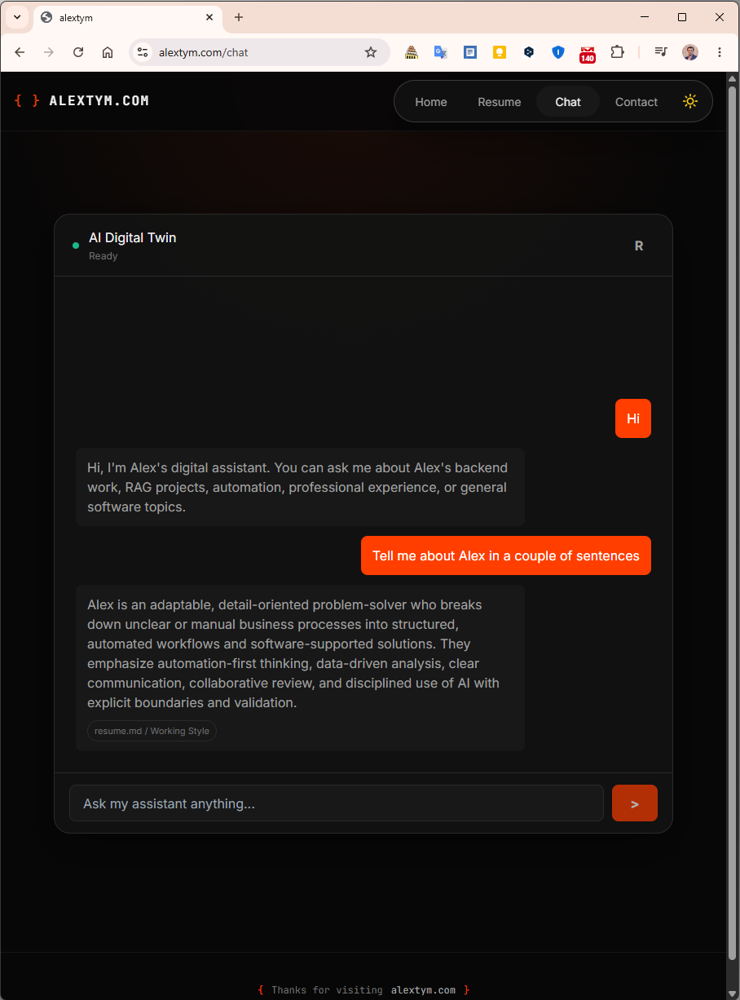

# Project Timeline

## Purpose

This document records the delivery timeline for `alextym.com`, a personal AI portfolio website with a RAG-based assistant.

## Summary

The first public version was delivered over **three working days**, from initial idea to deployment, with approximately **⏱️ 18 hours of focused development time**.

The MVP includes:

- Next.js frontend
- FastAPI backend
- RAG-based AI assistant
- OpenAI integration
- Qdrant vector search
- Streaming chat UI
- Contact form UI and backend
- Resend email delivery
- Basic daily rate limiting for chat and contact endpoints
- Honeypot handling for contact-form spam reduction
- Vercel frontend deployment
- Render backend deployment
- Cloudflare DNS and custom domain

## Delivery Window

| Item | Value |
|---|---|
| Initial commit | 2026-05-24 |
| Public backend routing commit | 2026-05-26 |
| Delivery duration | Under 3 days |
| Live domain | https://alextym.com |
| Backend host | Render |
| Frontend host | Vercel |

## Timeline

| Date | Milestone | Evidence | Notes |
|---|---|---|---|
| 2026-05-24 | Repository initialized | Initial commit `8146313` | Project started from an empty public repository. |
| 2026-05-25 | Frontend shell implemented | PR #12 | Added homepage, navigation, `/chat`, `/resume`, `/contact`, theme toggle and local workflow. |
| 2026-05-25 | Frontend UI polished | PR #13 | Improved visual design and page layout. |
| 2026-05-25 | Backend chat API added | PR #14 | Added chat endpoints, SSE format and backend tests. |
| 2026-05-25 | Public RAG skeleton added | PR #15 | Added chunking, metadata, retriever and prompt builder. |
| 2026-05-25 | OpenAI + Qdrant pipeline integrated | PR #16 | Added embeddings, Qdrant store, ingestion and RAG integration. |
| 2026-05-26 | Streaming chat UI connected | PR #20 | Connected frontend chat to backend SSE endpoint. |
| 2026-05-26 | Real RAG retrieval activated | PR #21 | Activated real OpenAI/Qdrant retrieval and public knowledge ingestion. |
| 2026-05-26 | RAG quality improved | PR #22 | Improved retrieval and answer formatting. |
| 2026-05-26 | Backend contact form and rate limiting added | PR #23 | Added Resend contact backend and basic abuse protection. |
| 2026-05-26 | Frontend contact form connected | PR #24 | Connected contact UI to backend. |
| 2026-05-26 | Conversation-aware chat added | PR #25 | Added short history, subject resolution and query rewriting. |
| 2026-05-26 | Frontend routed to Render backend | PR #26 | Connected Vercel `/api/*` rewrite to Render backend. |
| 2026-05-27 | Custom domain connected | Screenshot | `alextym.com` connected through Vercel/Cloudflare. |
| 2026-05-27 | Public MVP smoke-tested | Screenshot | Live frontend/backend/chat/contact checks. |

## Evidence Links

### GitHub

- Initial commit: `8146313`
- PR #12: Frontend shell
- PR #14: Backend chat service
- PR #15: RAG skeleton
- PR #16: OpenAI + Qdrant pipeline
- PR #20: Streaming chat UI
- PR #21: Real RAG activation
- PR #23: Contact form and rate limiting
- PR #25: Conversation-aware assistant
- PR #26: Render backend routing

### Screenshot

## Notes

This was a rapid MVP, not a final production system.

The delivery focused on proving the end-to-end architecture:

Browser → Vercel frontend → FastAPI backend → Qdrant → OpenAI → streamed chat response.

Further work can improve monitoring, analytics, persistent logs, stronger evals, contact escalation and production hardening.